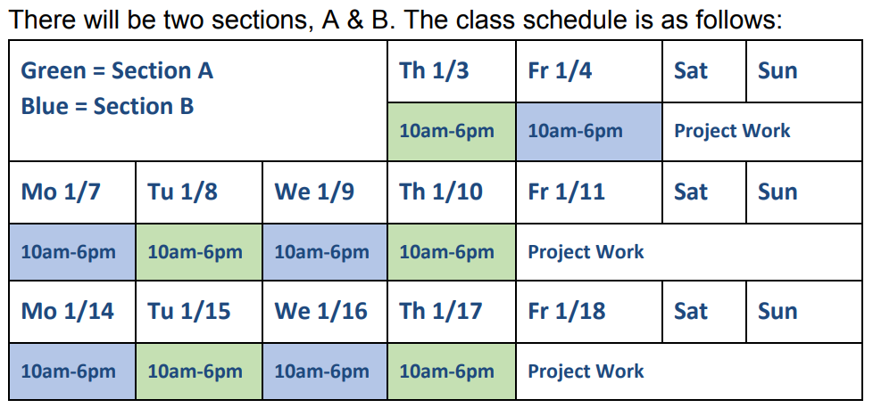

# Programming and Data for Policymakers [DPI-691M]

Instructor: [Dhrumil Mehta](https://www.hks.harvard.edu/faculty/dhrumil-mehta) - **January 2019**

Welcome to DPI-691M - Programming and Data for Policymakers

* Description: https://www.hks.harvard.edu/courses/programming-and-data-policymakers
* Syllabus: https://code4policy.github.io/2019/syllabus.pdf
* Slack: https://code4policy.slack.com
* Trello: https://trello.com/code4policy

# Day 0
like any good programmer, we start our counting with 0...

file | description
-----|------------
[syllabus.pdf](syllabus.pdf) | Syllabus
[precoursework.md](precoursework.md) | Pre-course Work
[windows.md](windows.md) | Special instructions for Windows users.
[setup.md](setup.md) | Setup
